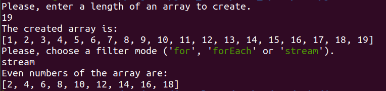
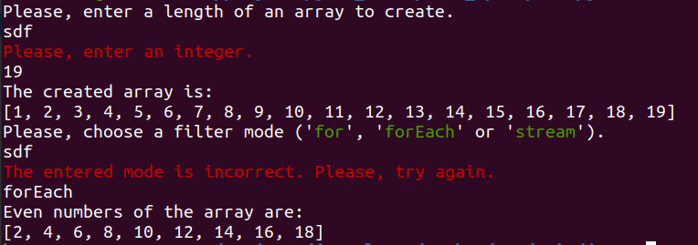

# Task

Get all even numbers from 1 to 100 use one of the following ways:
- for;
- forEach;
- stream.

# Solution

## Steps

1. Receive an array length from a user by a console (`Please, enter a length of an array to create`).
2. Create the array of numbers with entered length.
3. Receive a way to filtering the array from the user by the console (`Please, choose a filter mode ('for', 'forEach' or 'stream')`). 
4. Filter only even numbers.
5. Show the result to the user in the console (`Even numbers of the array are:`).

## Processing Exceptions

### The entered array length is not an integer

The message appears: `Please, enter an integer`. The user will receive it until they enter an integer.

### The entered filtering mode is unknown

The message appears: `The entered mode is incorrect. Please, try again.` The user will receive it until they enter any known mode: `for`, `forEach` or `stream`.

## Examples

### A positive case

### A negative case

## Classes

Class | Description
--- | ---
Main | Realizes the logic of the solution (see the 'Steps').
utils.ConsoleReader | Receives values from the user by the console.
utils.ArrayCreator | Creates a required array.
utils.ArrayFilter | Filters the array. The known modes are: 'for', 'forEach' and 'stream'.

## Methods

Class | Type | Method | Description
--- | --- | --- | ---
utils.ConsoleReader | int | getIntegerValue(String prompt) | Shows received text (`prompt`) in the console and returns the entered integer value.
| | String | getStringValue(String prompt) |  Shows received text (`prompt`) in the console and returns the entered string value.
utils.ArrayCreator | int[] | getArrayOfInteger(int length) | Creates an array of numbers from 1 to `length`.
utils.ArrayFilter | boolean | isFilterModeCorrect(String mode) | Check if the filter mode is known or not.
| | ArrayList\<Integer> | getEvenNumbers(int[] array, String mode) | Returns only even numbers received from the `array` by `mode`. 
